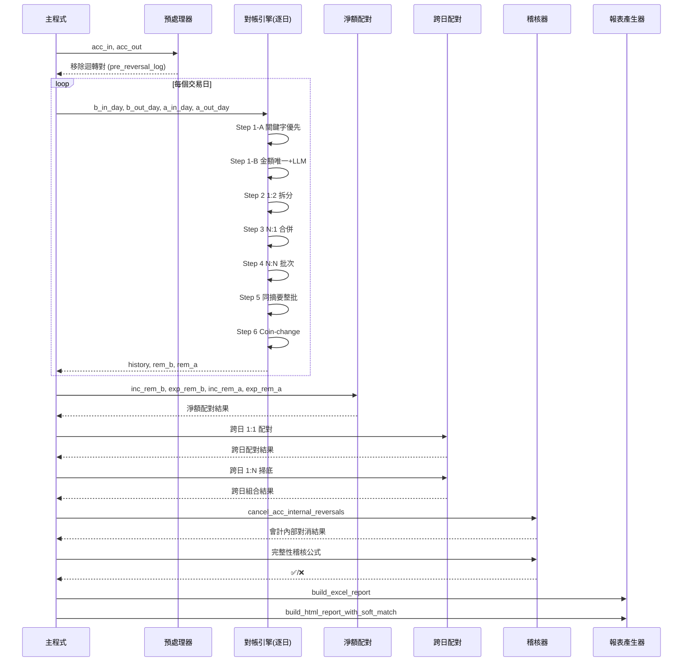

# 會計對帳系統分析報告
## Reconcile_Agent_PoC.py — 深度設計解析

---

## 1. 系統總覽

| 項目 | 內容 |
|------|------|
| 語言 | Python 3.x |
| 核心套件 | pandas、openpyxl、win32com、openai |
| AI 輔助 | GPT-4o-mini（用於語意模糊時的裁判） |
| 輸入 | 銀行對帳單（.xls/.xlsm/.xlsx）、帳務查詢（Excel 多 Sheet） |
| 輸出 | HTML 核銷報告、Excel 未入帳清單（含批注欄位） |
| 架構模式 | 管線式（Pipeline），逐月觸發，多階段遞進配對 |

### 系統目的

自動比對「銀行端流水帳」與「公司會計帳」，找出：
- **已核銷**：雙方均有記錄且金額吻合
- **待確認**：金額吻合但需人工確認語意
- **未入帳（銀行有、會計無）**：銀行發生了但會計尚未入帳
- **會計多入（會計有、銀行無）**：會計帳有記錄但銀行找不到對應

---

## 2. 整體流程圖

```
程式啟動
    │
    ▼
[Section 1] 掃描資料夾
    ├─ 找出所有「銀行對帳單-YYMM」檔案
    └─ 找出所有「帳務查詢」檔案
    │
    ▼
[Section 3] 轉換 & 合併帳務查詢的所有 Sheet
    │
    ▼
for 每個月份碼 → run_month_pipeline(month_code)
    │
    ├─[Section 4] load_and_preprocess()
    │   ├─ 載入銀行對帳單（skiprows=5，
    跳過表頭）
    │   ├─ 日內沖銷偵測（銀行端負值支出）
    │   ├─ 載入會計帳 Sheet、統一金額格式（含括號負值）
    │   └─ 輸出：bank_in, bank_out, acc_in, acc_out
    │
    ├─[Section 10.5] preprocess_acc_reversals()
    │   └─ 移除「迴轉分錄對」，避免原始分錄被銀行搶配
    │
    ├─ 階段一：逐日對帳（按交易日切分，各自執行 reconcile_engine）
    │   └─[Section 6] reconcile_engine() × 每日 × 收/支
    │       ├─ Step 1-A: 關鍵字優先配對
    │       ├─ Step 1-B: 金額唯一 + LLM 裁判
    │       ├─ Step 2: 1 Bank → 2 Acc
    │       ├─ Step 3: N Bank → 1 Acc（最多 4 筆）
    │       ├─ Step 4: 同金額 N:N 批次
    │       ├─ Step 5: 同摘要整批加總
    │       └─ Step 6: Coin-change 配對（容差 2,000 元）
    │
    ├─ 階段 1.5：淨額配對
    │   └─[Section 11] net_acc_reconcile()（迴轉後淨額 = 銀行金額）
    │
    ├─ 階段二：跨日對帳（±7 天窗口）
    │   ├─[Section 7] cross_day_reconcile()（1:1 跨日）
    │   └─[Section 7] final_sweep_cross_day()（1:N 跨日）
    │
    ├─[Section 8] find_soft_matches()（掃底：金額吻合但未配對）
    │
    ├─[Section 10] cancel_acc_internal_reversals()（會計內部對消）
    │
    ├─ 完整性稽核
    │   └─ 核銷 + 預沖 + 對消 + 剩餘 == 原始筆數
    │
    ├─[Section 9]  build_excel_report()
    └─[Section 12] build_html_report_with_soft_match()
```

---

## 3. 各模組詳解與設計決策

---

### 3.1 檔案掃描 — 副檔名優先度系統

```python
_EXT_PRIORITY = {'.xlsx': 0, '.xlsm': 1, '.xls': 2}
```

**設計動機（Edge Case）**：
`convert_to_xlsx()` 會將舊版 `.xls` 或 `.xlsm` 轉存為 `.xlsx`，轉換後資料夾內
**同一個底名會同時存在兩個檔**（例如 `銀行對帳單-11501.xls` 和 `銀行對帳單-11501.xlsx`）。
若沒有去重邏輯，下次執行時會重複載入同一份資料，導致金額加倍計算。
優先度系統確保「同底名只保留最佳版本」，`.xlsx` 永遠勝出。

---

### 3.2 銀行對帳單預處理 — 日內沖銷偵測

```
銀行對帳單常見場景：
  11/15  轉帳支出  -50,000   ← 真正的付款
  11/15  沖正轉支  +50,000   ← 同日沖銷（負的支出金額）

若不移除，兩筆都會進入配對池，導致會計帳找不到「兩筆」對應。
```

**實作邏輯**：
1. 找出所有 `支出金額 < 0` 的列（沖正記錄）
2. 在同日找金額相符的正向支出
3. 成對移除，記入 `reversal_log`（報告用）

**Edge Case**：銀行的「沖正」以負值存在 `支出金額` 欄，而非存入欄，需特別識別。

---

### 3.3 會計帳金額解析 — 括號負值

```python
def parse_amount(s):
    s = str(s).strip().replace(',', '')
    if s.startswith('(') and s.endswith(')'):
        s = '-' + s[1:-1]
    return pd.to_numeric(s, errors='coerce')
```

**設計動機（Edge Case）**：
台灣企業會計系統（如 ERP）匯出的 Excel 中，貸方金額常以 `(50,000)` 的括號格式表示負數，而非 `-50,000`。直接用 `pd.to_numeric` 會解析失敗（返回 NaN），導致所有貸方分錄消失。

---

### 3.4 業務日期解析 — 雙重 fallback

```python
try:
    df_acc['業務日期_格式化'] = pd.to_datetime(df_acc['業務日期'], errors='coerce').dt.strftime('%Y/%m/%d')
    if df_acc['業務日期_格式化'].isna().all():
        raise ValueError()
except Exception:
    df_acc['業務日期_格式化'] = pd.to_datetime(
        pd.to_numeric(df_acc['業務日期'], errors='coerce'),
        origin='1899-12-30', unit='D'
    ).dt.strftime('%Y/%m/%d')
```

**設計動機（Edge Case）**：
Excel 內部以「從 1899-12-30 起算的整數天數」儲存日期（例如 `45678`）。當 pandas 讀取未格式化的日期欄時，會讀到這個整數而非日期字串。若第一次解析全部失敗（`isna().all()`），代表是 Excel serial number，改用 `origin='1899-12-30'` 的方式轉換。

---

### 3.5 對帳引擎核心 — 六步驟遞進配對

```
reconcile_engine() 配對優先度流程：

最高優先 ──────────────────────────────────────────── 最低優先

 Step 1-A      Step 1-B       Step 2    Step 3     Step 4      Step 5    Step 6
關鍵字命中   金額唯一/LLM   1→2拆分   N→1合併   N:N批次   同摘要加總  Coin換零
(語意最確定) (數學唯一)    (分批入帳) (合批入帳) (等額配)  (整批薪資)  (多筆湊一)

──────────────────────────────────────────────────────────────────────────
為何 Step 1-A 必須優先於 Step 1-B？
──────────────────────────────────────────────────────────────────────────
場景：銀行有兩筆同金額，只有一筆附有語意附言

  銀行 A: 100,000  附言「台灣曼茲10月貨款」
  銀行 B: 100,000  附言（空白）
  會計 X: 100,000  描述「台灣曼茲科技股份有限公司」

❌ 若先執行 Step 1-B（金額唯一）：
     A 和 B 都能配上 X → 候選不唯一 → 兩者皆跳過 → 正確配對遺漏

✅ 先執行 Step 1-A（關鍵字命中）：
     A 以「曼茲」命中 X → 搶先配走
     B 已無候選 → 正確標記為「未入帳（銀行有、會計無）」

原則：語意優先於數學 — 防止「無附言銀行筆」搶走「有語意對應的會計筆」
```

---

### 3.6 中文關鍵字滑窗比對

```python
def _cjk_substrings(token, min_len=2):
    for sub_len in range(len(token), min_len - 1, -1):
        for start in range(len(token) - sub_len + 1):
            yield token[start:start + sub_len]
```

**設計動機（Edge Case）**：
```
銀行附言：「台灣曼茲科技股」(7字)
會計描述：「台灣曼茲10月份」(7字)

直接比較不吻合，但共有子字串「台灣曼茲」(4字)
→ 滑窗從最長子字串開始嘗試，找到「台灣曼茲」命中
```

**邏輯**：由長到短嘗試子字串（從長的開始是為了精確度，避免 2 字元誤配），且**只對中文 token** 啟用（英數字不用滑窗，因英文縮寫語意不同）。

---

### 3.7 LLM 裁判的邊界條件

```python
if candidates_df['描述.1'].astype(str).str.contains('銀行存款－台北富邦銀行', na=False).all():
    print("⏭️ 所有候選描述均為銀行存款，LLM 無法分辨，留待批次核銷")
    return None
```

**設計動機（Edge Case）**：
某些會計分錄的描述欄全部是「銀行存款－台北富邦銀行」這類通用描述，沒有任何可辨識的特徵。此時 LLM 即使再聰明也無法分辨哪筆是哪筆，強行呼叫只是浪費 API token 且結果不可信。設計上提前偵測並跳過，讓這些筆進入後續的批次配對邏輯。

---

### 3.8 Coin-change 配對

```python
COIN_MIN_AMT   = 1_000_000   # 只對 100 萬以上的大額才啟用
COIN_TOLERANCE = 2_000       # 差額在 2,000 元內視為吻合

def coin_fill(pool, amt_col, target):
    # 貪心算法：從最大面額開始填滿目標金額
```

**設計動機（Edge Case）**：
```
場景：公司支付一張 5,234,500 的帳款，但銀行端有多筆小額轉帳
  銀行 A: 2,000,000
  銀行 B: 1,500,000
  銀行 C: 1,200,000
  銀行 D:   534,500
  合計: 5,234,500 = 會計帳
```
貪心 coin-change 演算法從最大金額開始選，避免指數級組合爆炸。只對 100 萬以上啟用是因為小金額湊合誤配率高（100 元可以由很多種組合湊成）。

**容差 2,000 元**：銀行手續費或小數誤差會造成差額，2,000 元容差讓系統能吸收此類偏差。

---

### 3.9 會計迴轉預處理（Pre-processing）vs 內部對消（Post-processing）

這是系統中最精妙的設計之一，需特別說明兩者的差異：

```
預處理（preprocess_acc_reversals）— 銀行配對「前」執行
────────────────────────────────────────────────────
場景：
  會計 正方 P1: +100,000  描述「A公司10月貨款」
  會計 負方 N1:  -100,000  描述「迴轉原傳票：A公司10月貨款」  ← 含迴轉關鍵字

  銀行  B1: +100,000  (真正的收款)

如果不預處理：
  B1 配對到 P1（Step 1-A 關鍵字命中）✓
  N1 成為「會計多入」← 這是錯誤結果（N1 本就是沖銷 P1 的）

如果預處理：
  P1 和 N1 先行對消移出配對池
  B1 無法在會計池找到對應 → 顯示為「未入帳（銀行有、會計無）」← 正確

嚴格配對條件：c_desc in e_desc（原始描述必須被迴轉描述完整包含）
  ✅ 吻合：P1「A公司10月貨款」⊂ N1「迴轉原傳票：A公司10月貨款」→ 合法迴轉對
  ❌ 不吻合：P1「A公司10月」vs N2「迴轉B公司12月」→ 不同客戶，拒絕誤配
  原因：若只比金額，不相關的同金額分錄也可能被誤判為「迴轉對」
```

```
內部對消（cancel_acc_internal_reversals）— 銀行配對「後」執行
────────────────────────────────────────────────────────────
銀行配對完成後，剩餘的會計帳中若有「正方合計 = 負方金額」的組合，
視為會計系統內的自我沖銷，不需要對應的銀行記錄，從「多入」清單移除。

場景：銀行配對結束後，會計帳剩餘以下未配到的分錄
  剩餘 C: +200,000  描述「備用金撥付-A部門」
  剩餘 D: +300,000  描述「備用金撥付-B部門」
  剩餘 E: -500,000  描述「備用金沖銷」
  200,000 + 300,000 = 500,000 ← E 是 C+D 的內部對消 → 整組移出「多入」清單 ✓

配對寬鬆度（比預處理更寬鬆）：
  預處理   — 要求 c_desc ⊂ e_desc（語意驗證）且含迴轉關鍵字
  內部對消 — 只看金額等式，不驗證描述（銀行配對已完成，誤配風險低）
```

---

### 3.10 淨額配對（Net Reconciliation）

```
場景（常見於代扣代繳、退款調整）：
  銀行收款: +93,339

  會計正方: +93,623   (原始收款)
  會計負方:    -284   (含「迴轉」關鍵字的小額調整)
  淨額: 93,623 - 284 = 93,339 ← 吻合 ✓

保護條件：負方至少一筆必須含迴轉關鍵字
  ✅ 成立：-284 描述含「迴轉」→ 確認為合理的差額調整，允許配對
  ❌ 若無此條件（反例）：
       銀行收款: +50,000
       會計正方: +30,000（A客戶3月款）
       會計正方: +25,000（B客戶欠款）
       會計負方:  -5,000（C客戶退款，無迴轉關鍵字）
       30,000 + 25,000 - 5,000 = 50,000 → 數學成立，但三筆完全不相關 → 拒絕配對
```

---

### 3.11 跨日配對（±7 天窗口）

**設計動機（Edge Case）**：
會計入帳日期與銀行結算日期可能不同，常見於：
- 月底轉帳，銀行隔月才入帳
- 假日前的轉帳，值日多延 1-2 天
- 境外匯款，國際結算需 3-5 個工作日

7 天窗口能涵蓋大部分跨週末/跨假日的時差，但不會太寬鬆到產生誤配。

---

### 3.12 完整性稽核公式

```
銀行端稽核：
  核銷筆數 + 剩餘筆數 = 原始筆數

會計端稽核（更複雜）：
  核銷筆數 + 預沖（迴轉預處理）+ 內部對消 + 多入剩餘 = 原始筆數

範例（某月會計帳共 120 筆）：
  核銷     =  95  （Step 1-6 成功配對的分錄）
  預沖     =   8  （preprocess_acc_reversals 移除的迴轉對，共 4 組）
  內部對消 =   6  （cancel_acc_internal_reversals 移除，共 2 組）
  多入剩餘 =  11  （無銀行對應，最終列入「會計多入」待人工確認）
  稽核驗算：95 + 8 + 6 + 11 = 120 ✅

  若驗算失敗（例如 = 119），代表管線某個環節重複計算或遺漏了一筆，
  系統會拋出警告，防止 bug 靜默通過最終報告。
```

---

## 4. Sequence Diagram — 完整月份對帳流程



---

## 5. 資料流動示意

```
原始輸入                    配對結果分類
─────────                   ──────────────
銀行對帳單                  ┌─ 🟢 已核銷（直接輸出至報告）
  ├─ 存入 (bank_in)  ──────┤
  └─ 支出 (bank_out) ──────┤  ┌─ 🟡 待確認（金額吻合但需人工）
                            ├──┤
帳務查詢                    │  └─ 🔴 未入帳（銀行有、會計無）
  ├─ 正方 (acc_in)   ──────┤
  └─ 負方 (acc_out)  ──────┴─ 🟠 會計多入（會計有、銀行無）

                             ─ 🔵 預處理對消（迴轉對，配對前移除）
                             ─ 🟣 內部對消（配對後會計自消）
                             ─ 🔄 日內沖銷（銀行同日正負抵消）
```

---

## 6. 設計模式總結

| 模式 | 位置 | 用途 |
|------|------|------|
| 管線模式 (Pipeline) | `run_month_pipeline` | 多階段遞進，每階段減少剩餘池 |
| 策略模式 (Strategy) | `reconcile_engine` 6 步驟 | 各配對策略可獨立替換 |
| 貪心算法 (Greedy) | `coin_fill` | 近似最優的多對一金額湊合 |
| 責任鏈 (Chain of Responsibility) | Steps 1→6 | 前一步匹配後剩餘才進下一步 |
| 防衛性程式設計 | 稽核公式 | 最終驗證所有筆數守恆 |

---

## 7. 已知限制與改進空間

| 項目 | 現況 | 潛在改進 |
|------|------|---------|
| API Key 硬編碼 | `api_key = "sk-proj-..."` 直接寫在程式碼中 | 改用環境變數或 `.env` 檔 |
| Step 3 N:1 上限 | 最多 4 筆銀行合併，超過則跳過 | 可調整為參數 |
| 跨日窗口固定 | 硬編碼 7 天 | 可依幣別/匯款類型調整 |
| Coin-change 貪心 | 可能非最優解（但對財務場景夠用） | 可改為動態規劃但效能較差 |
| LLM 呼叫無快取 | 相同問題可能重複呼叫 API | 可加 LRU cache 節省費用 |
| 多月份序列執行 | `for month_code in sorted(...)` | 可改為平行處理 |

---

## 8. 快速上手

### 新增一個月份的對帳

只需在 `data_dir` 放入：
- `銀行對帳單-YYMM**.xls(x)` — 民國年月，例如 `銀行對帳單-11501.xlsx`
- `帳務查詢**.xls(x)` — 一或多份均可

執行程式，系統自動偵測並處理。

### 調整配對容差

```python
COIN_TOLERANCE = 2_000    # Coin-change 最大差額
COIN_MIN_AMT   = 1_000_000  # 啟用 Coin-change 的最小會計金額
NET_MAX_POS    = 2          # 淨額配對正方最多幾筆
NET_MAX_NEG    = 2          # 淨額配對負方（迴轉）最多幾筆
ACC_REVERSAL_MAX_COMBO = 4  # 會計內部對消最多幾筆正方
```

### 新增迴轉關鍵字

```python
PRE_REVERSAL_KEYWORDS = ['款項更正', '迴轉原傳票', '迴轉', '回轉', '沖銷', '沖正', '轉回']
NET_REVERSAL_KEYWORDS = ['迴轉', '回轉', '沖銷', '沖正', '轉回', '沖回']
# 注意：'沖回' 故意不加入 PRE_REVERSAL_KEYWORDS，
# 因為「當沖回補」是正常券商術語，會造成誤命中
```

---

*報告生成日期：2026-04-30*  
*分析對象：Reconcile_Agent_PoC.py（1,229 行）*
