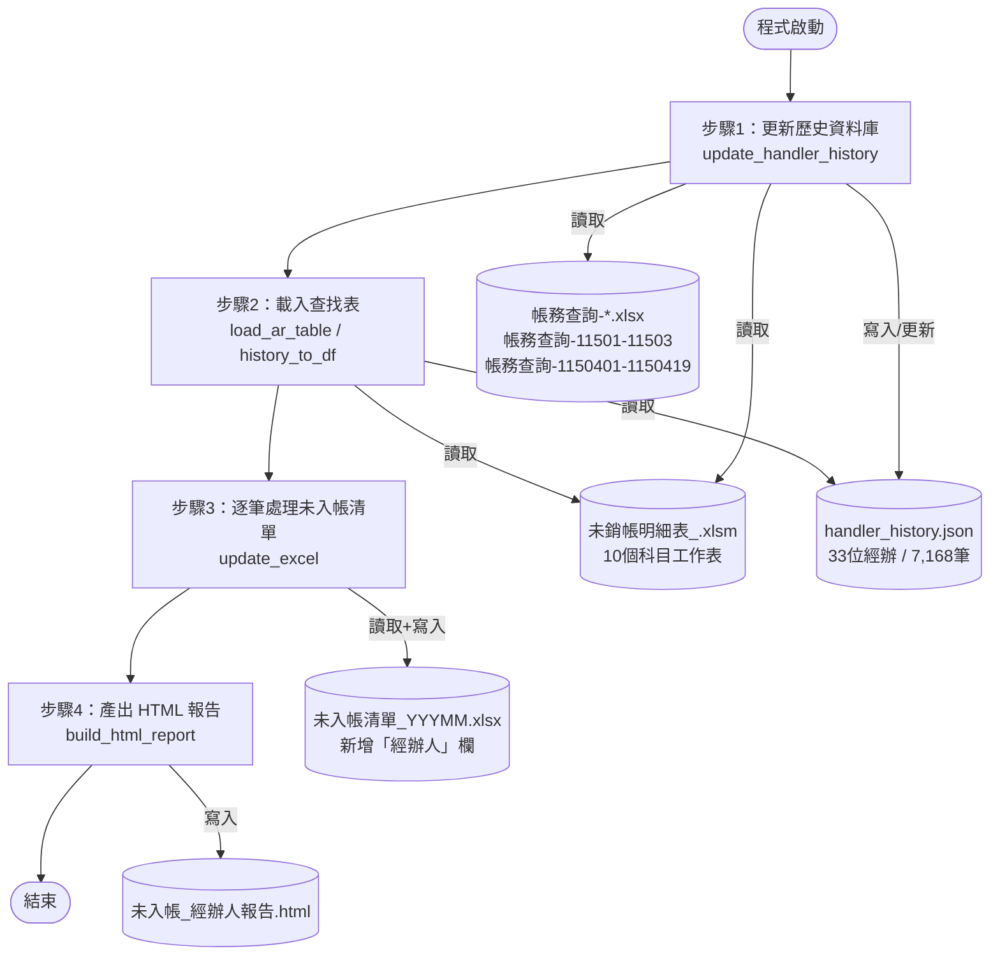
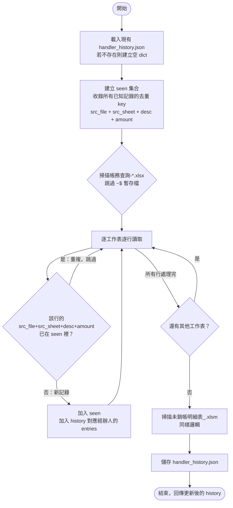
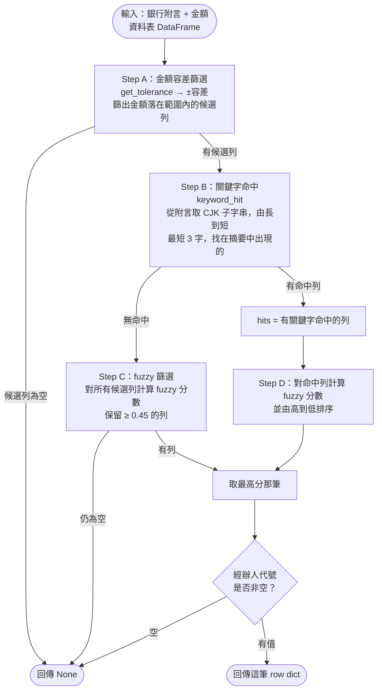
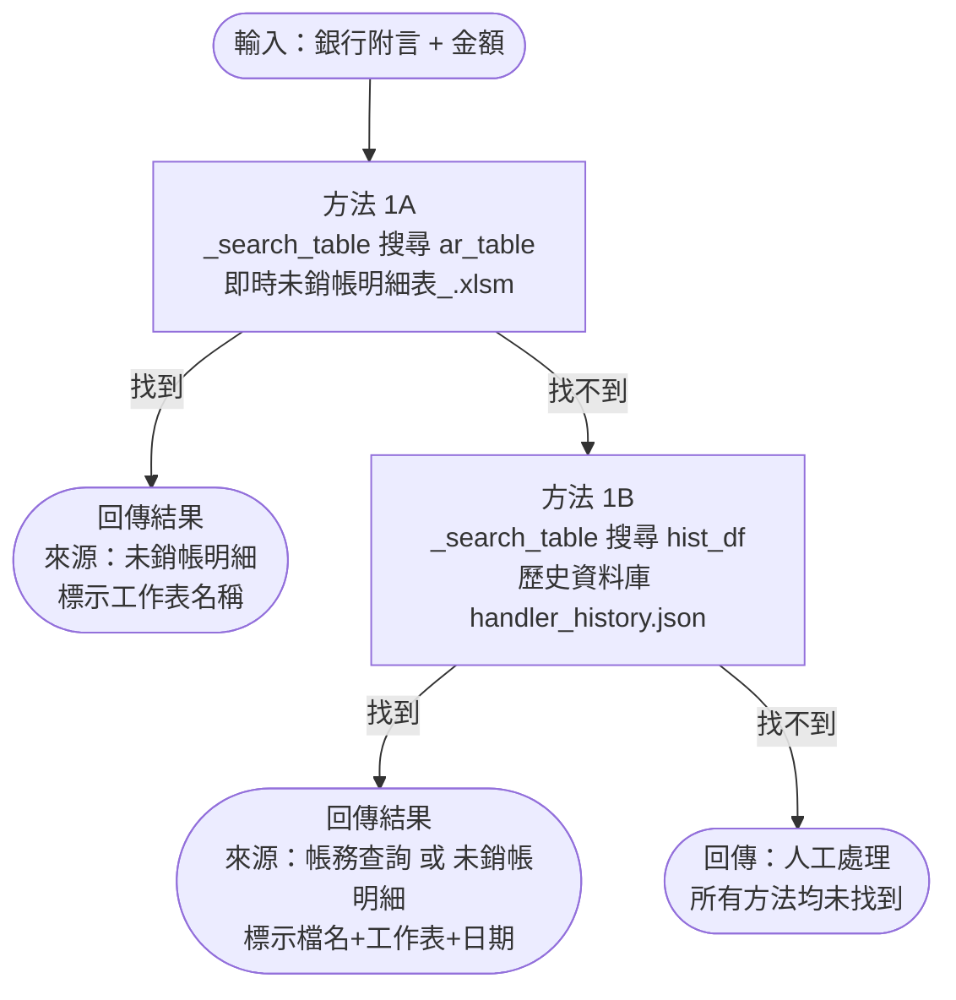
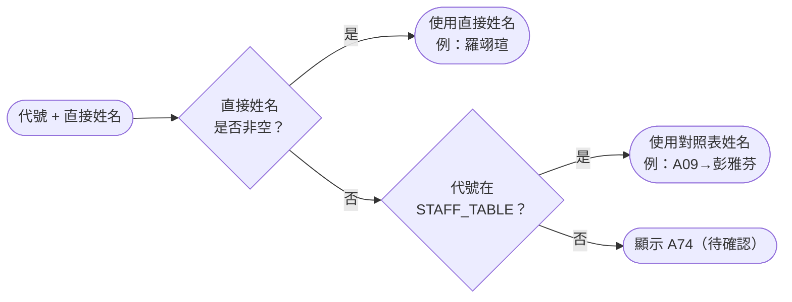
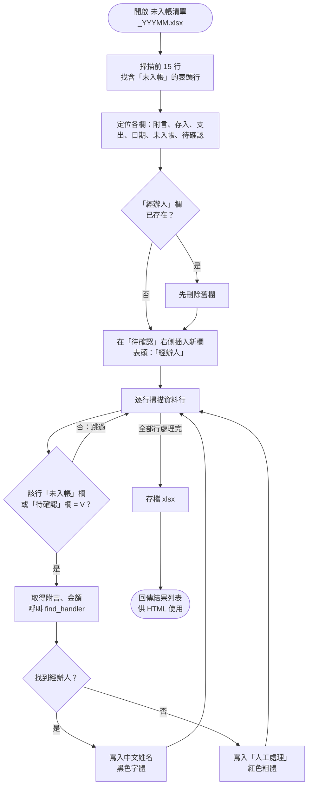

# find_handler.py 技術說明報告

> 本程式的目的：針對銀行對帳單中**尚未入帳**或**待確認**的每一筆交易，自動找出會計上的**經辦人**，並輸出標記後的 Excel 與 HTML 報告。

---

## 一、整體架構



**所有檔案均在同一個資料夾：** `C:\Users\user\Desktop\專案\會計對帳\資料\`

---

## 二、步驟1：歷史資料庫維護 `update_handler_history()`

### 為什麼要維護一個歷史資料庫？

銀行附言通常非常簡短（如「華南永昌證券投資」），而會計摘要通常更詳細（如「114/11~12月中國A股基金收入-華南永昌」）。如果每次只看**當月**的未銷帳明細，很可能找不到——因為這筆銀行款項可能是收到去年的費用，其會計記錄在更早的帳務查詢裡。

歷史資料庫就是把**所有月份**的帳務查詢和未銷帳明細累積起來，讓跨月查找成為可能。

### 流程



### 帳務查詢讀取哪些欄位？

| 欄位（0-based 索引） | 內容 | 範例 |
|---|---|---|
| col[0] | 憑証創建人代號 | `A74` |
| col[6] | 記帳日期 | `2026-01-15` |
| col[9] | 業務摘要（描述） | `114/11~12月中國A股基金收入-華南永昌` |
| col[11] | 業務金額（取絕對值） | `61.0` |
| col[41] | 用戶名稱（中文姓名） | `羅翊瑄` |

### 未銷帳明細讀取哪些欄位？

| 欄位（0-based 索引） | 內容 | 範例 |
|---|---|---|
| col[3] | 借方金額 | `1,015.00` |
| col[8] | 摘要 | `應收富邦建築02月份股代收入` |
| col[18] | 憑証創建人代號 | `A72` |

> 未銷帳明細沒有直接的日期欄（row level），所以 `date` 欄位留空。

### 去重邏輯

```python
key = f"{src_file}|{src_sheet}|{desc}|{amount}"
# 例：
# "帳務查詢-11501-11503.xlsx|11501|114/11~12月中國A股基金收入-華南永昌|61.0"
```

第二次執行時，這個 key 已在 `seen` 集合裡，所以不會重複新增。這保證了**增量 append** 的正確性。

### 歷史資料庫結構（JSON）

```json
{
  "A74": {
    "name": "羅翊瑄",
    "entries": [
      {
        "src_file":  "帳務查詢-11501-11503.xlsx",
        "src_sheet": "11501",
        "src_type":  "acc",
        "date":      "2026-01-15",
        "desc":      "114/11~12月中國A股基金收入-華南永昌",
        "amount":    61.0
      }
    ]
  },
  "A72": {
    "name": "黃琬芸",
    "entries": [ ... ]
  }
}
```

目前累積：**33 位經辦人，7,168 筆記錄**（4,755 筆來自帳務查詢、1,413 筆來自未銷帳明細）。

---

## 三、步驟2：載入查找用表

程式需要兩張查找表：

| 表格 | 來源 | 用途 |
|---|---|---|
| `ar_table` | 即時讀取 未銷帳明細表_.xlsm | 方法 1A |
| `hist_df` | 展開 handler_history.json | 方法 1B |

兩張表的欄位結構相同：

| 欄位 | 說明 |
|---|---|
| `_handler` | 經辦人代號（如 `A72`） |
| `_name` | 中文姓名（如 `黃琬芸`） |
| `_desc` | 摘要文字 |
| `_amount` | 金額（正數） |
| `_date` | 日期（帳務查詢才有） |
| `_file` | 來源檔名 |
| `_sheet` | 來源工作表 |

---

## 四、步驟3：核心查找引擎 `_search_table()`

這是整個程式最關鍵的函數。給定一筆銀行記錄（附言、金額），在一張表格裡找最匹配的一筆。

### 整體流程



---

### Step A：金額容差篩選 `get_tolerance()`

**為什麼要有容差？** 銀行記帳與會計入帳之間常有手續費、匯差等小額差距，不能要求完全一致。

**為什麼分兩段？** 金額越小，±2,000 就相對太寬——1,147 元的交易，±2,000 範圍內有 322 筆候選，全是噪音。

```python
def get_tolerance(amount):
    return 500 if amount <= 10_000 else 2_000
```

| 銀行金額 | 容差 | 接受範圍 |
|---|---|---|
| 1,147 元 | ±500 | 647 ~ 1,647 |
| 54,741 元 | ±2,000 | 52,741 ~ 56,741 |
| 102 元 | ±500 | −398 ~ 602（實際只取正數，即 0~602） |

**例：**
- 銀行：`羅東分行 / 54,741 元`
- 未銷帳明細裡有「代墊銀行-115.03台灣電力電費(羅東分行)」金額 54,500 元
- |54,741 − 54,500| = 241 ≤ 2,000 ✅ 進入候選

---

### Step B：關鍵字命中 `keyword_hit()`

**為什麼要做關鍵字比對，而不直接用 fuzzy？** fuzzy 對長短差異很大的句子效果差（短附言 vs 長摘要，天生低分），而關鍵字比對只需要找到「最關鍵那個詞」。

**滑窗子字串：** 從附言的 CJK 字元中，由長到短依次嘗試：

```
附言：「羅東分行」→ CJK = 「羅東分行」（4字）

嘗試順序：
  「羅東分行」(4字) → 在摘要「代墊銀行-115.03台灣電力電費(羅東分行)」中？ ✅ 命中！
```

```
附言：「富邦敦南三月電」→ CJK = 「富邦敦南三月電」（7字）

嘗試順序：
  「富邦敦南三月電」(7字) → ✗
  「富邦敦南三月」(6字)  → ✗
  「富邦敦南三」(5字)    → ✗
  「富邦敦南」(4字)      → ✗
  「富邦敦」(3字)        → ✗
  → 最短門檻 3 字，停止
  ⟹ keyword_hit = False（不算命中）
```

**為什麼最短 3 字（`MIN_KEYWORD_LEN = 3`）？**

2 字的詞往往太泛，會導致大量誤配：

| 短詞 | 問題 |
|---|---|
| `富邦` | 富邦銀行、富邦人壽、富邦建築、富邦科技都有 |
| `薪資` | 所有薪資相關摘要都命中 |
| `電費` | 所有電費記錄都命中 |

實際案例：`富邦敦南三月電` 若允許 2 字命中，「富邦」會觸發「應收富邦建築02月份股代收入」（金額 1,015，fuzzy 只有 0.29），導致誤配為 A72。

---

### Step C/D：Fuzzy 相似度 `fuzzy_score()`

使用 Python 標準庫 `difflib.SequenceMatcher.ratio()`：

```
ratio = 2 × M / T

M = 兩字串的共同字元數（按序列比對）
T = 兩字串的總字元數
```

**實際計算範例：**

```
a = "富邦敦南三月電"       → 7字
b = "應收富邦建築02月份股代收入" → 14字（含數字）

共同塊：
  "富邦" → 2字（在 a[0:2] 與 b[2:4]）
  "月"   → 1字（在 a[5] 與 b[8]）

M = 3，T = 21
ratio = 2×3/21 = 0.286
```

**閾值說明：**

| 路徑 | 閾值 | 原因 |
|---|---|---|
| 有關鍵字命中 → fuzzy 排序 | 無下限 | 關鍵字已確認業務相關，fuzzy 只用於排序 |
| 無關鍵字命中 → fuzzy 篩選 | ≥ 0.45 | 沒有關鍵字確認，需要整體相似度夠高才採用 |

**例（無關鍵字，走 fuzzy 路徑）：**

```
附言：「謝旻霏溢領薪資」，金額 16,727
→ 無 3 字以上子字串命中任何候選摘要
→ 轉 fuzzy 路徑
→ 最高分 0.17 < 0.45
→ 回傳 None → 人工處理
```

---

## 五、步驟4：查找優先順序 `find_handler()`



### 為什麼 1A 優先於 1B？

- **1A（未銷帳明細）** 是當期尚未結清的帳，**最貼近當下業務狀態**
- **1B（歷史資料庫）** 包含過去的帳務查詢，跨月資料更多，但可能匹配到已結清的舊帳

如果 1A 和 1B 都有結果，優先採用 1A 的更即時。

### 實際案例

| 銀行附言 | 金額 | 結果 | 說明 |
|---|---|---|---|
| 羅東分行 | 54,741 | 🟢 1A A12 許嘉芳 | 未銷帳明細有「代墊銀行-115.03台灣電力電費(羅東分行)」，金額差 241，關鍵字「羅東分行」命中 |
| 華南永昌證券投資 | 102 | 🟢 1B A74 羅翊瑄 | 未銷帳明細無匹配；歷史資料庫（帳務查詢-11501-11503）有「114/11~12月中國A股基金收入-華南永昌」，金額 61，差 41，關鍵字「華南永昌」（4字）命中 |
| 富邦敦南三月電 | 1,147 | 🔴 人工處理 | 無 3 字以上子字串命中；純 fuzzy 最高 0.286 < 0.45 |

### 姓名解析邏輯 `resolve_name()`



帳務查詢的 col[41] 直接有中文姓名（如羅翊瑄），不需要查 STAFF_TABLE。STAFF_TABLE 只涵蓋 A01–A28，A74 等擴充代號靠帳務查詢的直接姓名。

---

## 六、步驟5：更新 Excel `update_excel()`



**識別標記行的條件：** 「未入帳」欄或「待確認」欄的值為 `"V"`（大寫V）。

**重跑安全性：** 若「經辦人」欄已存在（重複執行時），程式會先刪除再重建，不會出現重複欄位。

---

## 七、步驟6：HTML 報告 `build_html_report()`

報告為一份自含 CSS 的靜態 HTML，包含：

1. **總覽卡片**：總筆數、命中數、人工處理數、方法分佈
2. **逐月明細表**：每筆的銀行日期、附言、金額、查找方法、經辦人、來源依據

**來源依據欄** 格式（例）：
```
帳務查詢-11501-11503.xlsx
工作表：11501
日期：2026-01-15
金額：61
摘要：114/11~12月中國A股基金收入-華南永昌
```

---

## 八、參數一覽

| 參數 | 值 | 作用 |
|---|---|---|
| `FUZZY_THRESHOLD` | 0.45 | 無關鍵字命中時，fuzzy 分數需達此值才採用 |
| `MIN_KEYWORD_LEN` | 3 | 關鍵字子字串至少需有幾個 CJK 字才算命中 |
| `get_tolerance(amt)` | ≤10,000 → ±500；>10,000 → ±2,000 | 金額容差 |

---

## 九、如何擴充

### 新增帳務查詢月份
把新的 `帳務查詢-*.xlsx` 放進 `資料\` 資料夾，下次執行程式會自動掃描並 append 進 `handler_history.json`，不需要修改程式。

### 新增未入帳清單月份
把新的 `未入帳清單_YYYMM.xlsx` 放進 `資料\` 資料夾，程式會自動偵測並處理。

### 新增員工代號
在 `STAFF_TABLE` dict 中加入對應（例：`'A74': '羅翊瑄'`）。注意：帳務查詢的 col[41] 已有直接姓名，只需補充未銷帳明細裡才出現的代號。

### 調整比對嚴格度
- 覺得誤配太多 → 提高 `FUZZY_THRESHOLD`（如 0.50）或 `MIN_KEYWORD_LEN`（如 4）
- 覺得漏配太多 → 降低 `FUZZY_THRESHOLD`（如 0.40）或 `MIN_KEYWORD_LEN`（如 2，但注意泛用詞問題）
